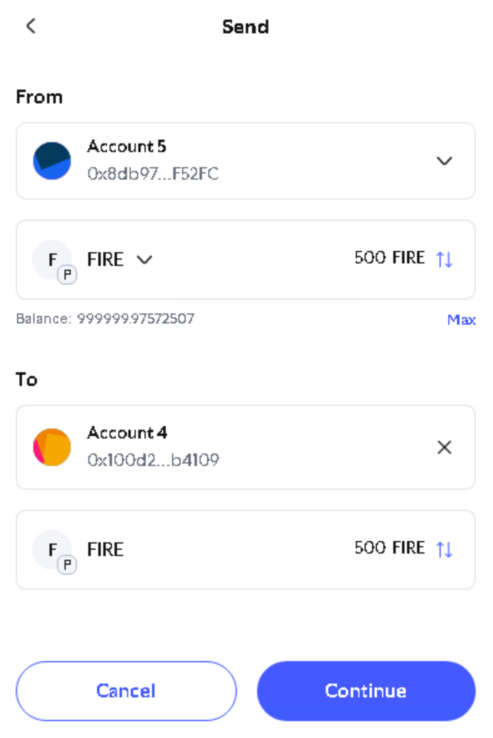
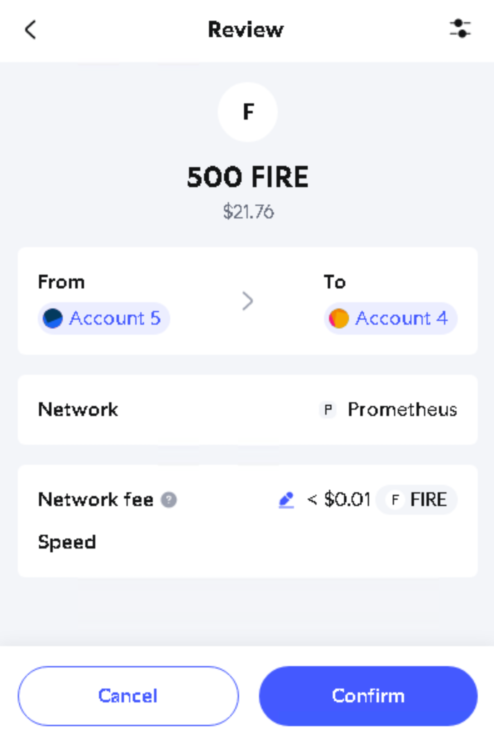
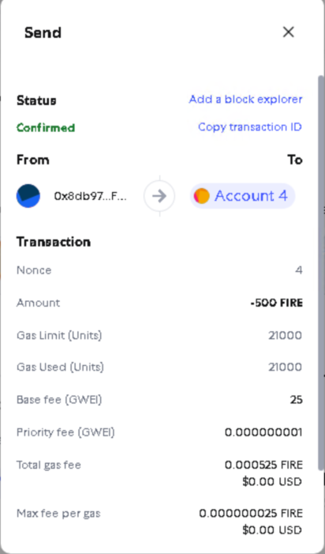

# Avalanche本地测试网部署步骤
## 1. 安装环境Avachelanche-CLI环境

根据Avalanche官网描述，最快捷的方式为使用官方shell脚本，具体执行命令如下：
```shell
curl -sSfL https://raw.githubusercontent.com/ava-labs/avalanche-cli/main/scripts/install.sh | sh -s
```
注意:本脚本涉及外网环境访问，需自己解决网络请求问题，我个人使用自建服务器。
出现以下三行提示后，继续执行后面操作：
```shell
ava-labs/avalanche-cli info checking GitHub for latest tag
ava-labs/avalanche-cli info found version: 1.8.10 for linux/amd64
ava-labs/avalanche-cli info installed /root/bin/avalanche
```
注意：我个人使用root账户登录，所以最后一行路径为/root/bin/avalanche
然后根据官网提示，配置环境变量：
```shell
export PATH=~/bin:$PATH
echo 'export PATH=~/bin:$PATH' >> ~/.bashrc
source ~/.bashrc
```
执行完以上三行命令后，在命令行输入 avalanche 回车后，如出现以下提示，则说明安装成功：
```shell
Avalanche-CLI is a command-line tool that gives developers access to
everything Avalanche. This release specializes in helping developers
build and test Blockchain networks.

To get started, look at the documentation for the subcommands or jump right
in with avalanche blockchain create myNewBlockchain.

Usage:
  avalanche [command]

Available Commands:
  blockchain  Create and deploy blockchains
  config      Modify configuration for Avalanche-CLI
  contract    Manage smart contracts
  help        Help about any command
  icm         Interact with ICM messenger contracts
  ictt        Manage Interchain Token Transferrers (shorthand for `interchain TokenTransferrer`)
  interchain  Set and manage interoperability between blockchains
  key         Create and manage testnet signing keys
  network     Manage locally deployed blockchains
  node        Set up fuji and mainnet validator on cloud service
  primary     Interact with the Primary Network
  teleporter  Interact with ICM messenger contracts
  transaction Sign and execute specific transactions
  update      Check for latest updates of Avalanche-CLI
  validator   Manage P-Chain validator balance

Flags:
      --config string       config file (default is $HOME/.avalanche-cli/config.json)
  -h, --help                help for avalanche
      --log-level string    log level for the application (default "ERROR")
      --skip-update-check   skip check for new versions
  -v, --version             version for avalanche

Use "avalanche [command] --help" for more information about a command.
```
此时我们进行第二步操作。

## 2. 创建本地L1网络

根据官网提示，输入avalanche的创建区块链命令：
```shell
avalanche blockchain create myblockchain
```
其中 myblockchain 为你个人自定义区块链名称。
本次Avalanche bootcamp为我个人第一次创建部署本地L1网络，为表示纪念，我创建的网络名为 Prometheus（普罗米修斯），意即将blockchain知识教给我。

执行创建命令后，会提示选择虚拟机环境，提示信息如下：
```shell
Use the arrow keys to navigate: ↓ ↑ → ←
? Which Virtual Machine would you like to use?:
  ▸ Subnet-EVM    #官方内置的EVM虚拟机
    Custom VM     #自定义虚拟机
    Explain the difference   #解释两者区别
```
因为我目前还不具备创建自定义虚拟机的能力，所以使用官方提供的EVM虚拟机。

选择虚拟机类型后，会提示选择验证者管理模式，提示信息如下：
```shell
Use the arrow keys to navigate: ↓ ↑ → ←
? Which validator management type would you like to use in your blockchain?:
  ▸ Proof Of Authority     #权威证明模式
    Proof Of Stake         #权益证明模式
    Explain the difference  #解释两者区别
```
权威证明被认为是比权益证明更先进一些的证明模式，我们此次选择权威证明。

选择证明类型后，会再次提示选择证明管理的合约地址：
```shell
Use the arrow keys to navigate: ↓ ↑ → ←
? Which address do you want to enable as controller of ValidatorManager contract?:
  ▸ Get address from an existing stored key (created from avalanche key create or avalanche key import)
    Custom
```
我们目前没有自建管理的智能合约，只能选择系统内置的合约地址。
然后会让我们选内置的哪一个类型的管理器合约，这里我们选择ewoq：
```shell
Use the arrow keys to navigate: ↓ ↑ → ←
? Which stored key should be used enable as controller of ValidatorManager contract?:
  ▸ ewoq
    cli-teleporter-deployer
```

然后提示选择部署的环境类型（测试环境？生产环境？）我们选择测试环境：
```shell
Use the arrow keys to navigate: ↓ ↑ → ←
? Do you want to use default values for the Blockchain configuration?:
  ▸ I want to use defaults for a test environment
    I want to use defaults for a production environment
    I don't want to use default values
    Explain the difference
```

然后提示让我们输入测试环境的ChainID，此ID不可重复，我们随便输入一个89757：
```shell
✔ I want to use defaults for a test environment
✗ Chain ID: █
```

然后选择代币的代号，因为是普罗米修斯，我们的代号当然是FIRE：
```shell
 Token Symbol:
```
都输入完毕后，本地测试网创建完毕，提示信息如下，其中给管理者地址创建了足够多的代币：
```shell
prefunding address 0x8db97C7cEcE249c2b98bDC0226Cc4C2A57BF52FC with balance 1000000000000000000000000
Installing subnet-evm-v0.7.3...
subnet-evm-v0.7.3 installation successful
File /root/.avalanche-cli/subnets/Prometheus/chain.json successfully written
✓ Successfully created blockchain configuration
Run 'avalanche blockchain describe' to view all created addresses and what their roles are
```

## 3. 部署本地L1网络

创建完测试L1网络后，我们可以进行网络的部署，我们可以通过输入部署命令进行部署：
```shell
avalanche blockchain deploy <blockchainName>
```
其中<blockchainName>为你自建的网络名称，比如我的是 Prometheus。
系统会提示让你选择部署的网络位置，如本地、开发网、Fuji测试网、主网：
```shell
Use the arrow keys to navigate: ↓ ↑ → ←
? Choose a network for the operation:
  ▸ Local Network
    Devnet
    Fuji Testnet
    Mainnet
```
这次我们是本地部署，就选择Local Network。该命令也可以直接简化为：
```shell
avalanche blockchain deploy <blockchainName> --local
```

系统会开始部署，并启动本地RPC节点，经过短暂的等待，本地测试网部署完毕。
```shell
Deploying [Prometheus] to Local Network

Installing avalanchego-v1.13.0...
avalanchego-v1.13.0 installation successful
AvalancheGo path: /root/.avalanche-cli/bin/avalanchego/avalanchego-v1.13.0/avalanchego

Booting Network. Wait until healthy...

Node logs directory: /root/.avalanche-cli/runs/network_20250527_224116/<NodeID>/logs

Network ready to use.

Using [P-custom18jma8ppw3nhx5r4ap8clazz0dps7rv5u9xde7p] to be set as a change owner for leftover AVAX
AvalancheGo path: /root/.avalanche-cli/bin/avalanchego/avalanchego-v1.13.0/avalanchego

✓ Local cluster Prometheus-local-node-local-network not found. Creating...
Starting local avalanchego node using root: /root/.avalanche-cli/local/Prometheus-local-node-local-network ...
✓ Booting Network. Wait until healthy...
✓ Avalanchego started and ready to use from /root/.avalanche-cli/local/Prometheus-local-node-local-network

Node logs directory: /root/.avalanche-cli/local/Prometheus-local-node-local-network/<NodeID>/logs

Network ready to use.

URI: http://127.0.0.1:43731
NodeID: NodeID-DTPeRawa5gDGGkBBWfwayRZoHBrw9i7Vz

Your blockchain control keys: [******]
Your blockchain auth keys for chain creation: [***]
CreateSubnetTx fee: 0.000010278 AVAX
Blockchain has been created with ID: 2W9boARgCWL25z6pMFNtkCfNA5v28VGg9PmBgUJfuKndEdhrvw
Now creating blockchain...
CreateChainTx fee: 0.000129564 AVAX
+--------------------------------------------------------------------+
|                         DEPLOYMENT RESULTS                         |
+---------------+----------------------------------------------------+
| Chain Name    | Prometheus                                         |
+---------------+----------------------------------------------------+
| Subnet ID     | 2W9boARgCWL25z6pMFNtkCfNA5v28VGg9PmBgUJfuKndEdhrvw |
+---------------+----------------------------------------------------+
| VM ID         | cRuqW3KCJxBPxnMRwAXmvX7iuVegvovB9HLjaMeo57uYCgEzo  |
+---------------+----------------------------------------------------+
| Blockchain ID | 4wARdhqnRDExzQCUq8XTbwa9bmtdDAtnPwXUHjrdnP55AJXeX  |
+---------------+                                                    |
| P-Chain TXID  |                                                    |
+---------------+----------------------------------------------------+
Now calling ConvertSubnetToL1Tx...
ConvertSubnetToL1Tx fee: 0.000036992 AVAX
ConvertSubnetToL1Tx ID: XWZfzmr3LaDgLiDbSGz7uGMyy3txhvZ5Phb6RM7C3dT99xDR9
Waiting for the Subnet to be converted into a sovereign L1 ... 100% [===============]

Validator Manager Protocol: ACP99
Restarting node NodeID-DTPeRawa5gDGGkBBWfwayRZoHBrw9i7Vz to track newly deployed subnet/s
Waiting for blockchain 4wARdhqnRDExzQCUq8XTbwa9bmtdDAtnPwXUHjrdnP55AJXeX to be bootstrapped
✓ Local Network successfully tracking Prometheus
✓ Checking if node is healthy...
✓ Node is healthy after 0 seconds
Initializing Proof of Authority Validator Manager contract on blockchain Prometheus ...
✓ Proof of Authority Validator Manager contract successfully initialized on blockchain Prometheus

Your L1 is ready for on-chain interactions.

RPC Endpoint: http://127.0.0.1:43731/ext/bc/4wARdhqnRDExzQCUq8XTbwa9bmtdDAtnPwXUHjrdnP55AJXeX/rpc
ICM Messenger successfully deployed to Prometheus (0x253b2784c75e510dD0fF1da844684a1aC0aa5fcf)
ICM Registry successfully deployed to Prometheus (0x022A037011083f0e7a5f5b5758B62d6F05402b36)
ICM Messenger successfully deployed to c-chain (0x253b2784c75e510dD0fF1da844684a1aC0aa5fcf)
ICM Registry successfully deployed to c-chain (0x17aB05351fC94a1a67Bf3f56DdbB941aE6c63E25)
✓ ICM is successfully deployed

Generating relayer config file at /root/.avalanche-cli/runs/network_20250527_224116/icm-relayer-config.json
Relayer version icm-relayer-v1.6.4
Installing Relayer
Executing Relayer
✓ Relayer is successfully deployed

+--------------------------------------------------------------------------------------------------------------------------------+
|                                                           PROMETHEUS                                                           |
+---------------+----------------------------------------------------------------------------------------------------------------+
| Name          | Prometheus                                                                                                     |
+---------------+----------------------------------------------------------------------------------------------------------------+
| VM ID         | cRuqW3KCJxBPxnMRwAXmvX7iuVegvovB9HLjaMeo57uYCgEzo                                                              |
+---------------+----------------------------------------------------------------------------------------------------------------+
| VM Version    | v0.7.3                                                                                                         |
+---------------+----------------------------------------------------------------------------------------------------------------+
| Validation    | Proof Of Authority                                                                                             |
+---------------+--------------------------+-------------------------------------------------------------------------------------+
| Local Network | ChainID                  | 89757                                                                               |
|               +--------------------------+-------------------------------------------------------------------------------------+
|               | SubnetID                 | 2W9boARgCWL25z6pMFNtkCfNA5v28VGg9PmBgUJfuKndEdhrvw                                  |
|               +--------------------------+-------------------------------------------------------------------------------------+
|               | Owners (Threhold=1)      | ***                                    |
|               +--------------------------+-------------------------------------------------------------------------------------+
|               | BlockchainID (CB58)      | 4wARdhqnRDExzQCUq8XTbwa9bmtdDAtnPwXUHjrdnP55AJXeX                                   |
|               +--------------------------+-------------------------------------------------------------------------------------+
|               | BlockchainID (HEX)       | 0x08eea856baed9710fd58071e2a68a400e97fa9c7ef089ec93a16171853e05433                  |
|               +--------------------------+-------------------------------------------------------------------------------------+
|               | RPC Endpoint             | http://127.0.0.1:43731/ext/bc/4wARdhqnRDExzQCUq8XTbwa9bmtdDAtnPwXUHjrdnP55AJXeX/rpc |
+---------------+--------------------------+-------------------------------------------------------------------------------------+

+------------------------------------------------------------------------------------+
|                                         ICM                                        |
+---------------+-----------------------+--------------------------------------------+
| Local Network | ICM Messenger Address | 0x253b2784c75e510dD0fF1da844684a1aC0aa5fcf |
|               +-----------------------+--------------------------------------------+
|               | ICM Registry Address  | 0x022A037011083f0e7a5f5b5758B62d6F05402b36 |
+---------------+-----------------------+--------------------------------------------+

+---------------------------+
|           TOKEN           |
+--------------+------------+
| Token Name   | FIRE Token |
+--------------+------------+
| Token Symbol | FIRE       |
+--------------+------------+

+----------------------------------------------------------------------------------------------------------------------------------------+
|                                                        INITIAL TOKEN ALLOCATION                                                        |
+-------------------------+------------------------------------------------------------------+---------------+---------------------------+
| DESCRIPTION             | ADDRESS AND PRIVATE KEY                                          | AMOUNT (FIRE) | AMOUNT (WEI)              |
+-------------------------+------------------------------------------------------------------+---------------+---------------------------+
| Used by ICM             | 0x100d291D3bF7E4044dFa687482363c7aC1Db4109                       | 600           | 600000000000000000000     |
| cli-teleporter-deployer | ****                                                             |               |                           |
+-------------------------+------------------------------------------------------------------+---------------+---------------------------+
| Main funded account     | 0x8db97C7cEcE249c2b98bDC0226Cc4C2A57BF52FC                       | 1000000       | 1000000000000000000000000 |
| ewoq                    | ****                                                             |               |                           |
+-------------------------+------------------------------------------------------------------+---------------+---------------------------+

+----------------------------------------------------------------------------------------------------------------------------------+
|                                                          SMART CONTRACTS                                                         |
+----------------------------------------+--------------------------------------------+--------------------------------------------+
| DESCRIPTION                            | ADDRESS                                    | DEPLOYER                                   |
+----------------------------------------+--------------------------------------------+--------------------------------------------+
| Transparent Proxy                      | 0x0Feedc0de0000000000000000000000000000000 |                                            |
+----------------------------------------+--------------------------------------------+--------------------------------------------+
| Validator Messages Lib                 | 0x9C00629cE712B0255b17A4a657171Acd15720B8C |                                            |
+----------------------------------------+--------------------------------------------+--------------------------------------------+
| Proxy Admin                            | 0xC0fFEE1234567890aBCdeF1234567890abcDef34 | 0x8db97C7cEcE249c2b98bDC0226Cc4C2A57BF52FC |
+----------------------------------------+--------------------------------------------+--------------------------------------------+
| ACP99 Compatible PoA Validator Manager | 0x0C0DEbA5E0000000000000000000000000000000 |                                            |
+----------------------------------------+--------------------------------------------+--------------------------------------------+

+----------------------------------------------------------------------+
|                      INITIAL PRECOMPILE CONFIGS                      |
+------------+-----------------+-------------------+-------------------+
| PRECOMPILE | ADMIN ADDRESSES | MANAGER ADDRESSES | ENABLED ADDRESSES |
+------------+-----------------+-------------------+-------------------+
| Warp       | n/a             | n/a               | n/a               |
+------------+-----------------+-------------------+-------------------+

+-------------------------------------------------------------------------------------------------+
|                                       PROMETHEUS RPC URLS                                       |
+-----------+-------------------------------------------------------------------------------------+
| Localhost | http://127.0.0.1:43731/ext/bc/4wARdhqnRDExzQCUq8XTbwa9bmtdDAtnPwXUHjrdnP55AJXeX/rpc |
+-----------+-------------------------------------------------------------------------------------+

+------------------------------------------------------------------+
|                           PRIMARY NODES                          |
+------------------------------------------+-----------------------+
| NODE ID                                  | LOCALHOST ENDPOINT    |
+------------------------------------------+-----------------------+
| NodeID-7Xhw2mDxuDS44j42TCB6U5579esbSt3Lg | http://127.0.0.1:9650 |
+------------------------------------------+-----------------------+
| NodeID-MFrZFVCXPv5iCn6M9K6XduxGTYp891xXZ | http://127.0.0.1:9652 |
+------------------------------------------+-----------------------+
+--------------------------------------------------------------------------------+
|                                    L1 NODES                                    |
+------------------------------------------+------------------------+------------+
| NODE ID                                  | LOCALHOST ENDPOINT     | L1         |
+------------------------------------------+------------------------+------------+
| NodeID-DTPeRawa5gDGGkBBWfwayRZoHBrw9i7Vz | http://127.0.0.1:43731 | Prometheus |
+------------------------------------------+------------------------+------------+

+-------------------------------------------------------------------------------------------------------+
|                                           WALLET CONNECTION                                           |
+-----------------+-------------------------------------------------------------------------------------+
| Network RPC URL | http://127.0.0.1:43731/ext/bc/4wARdhqnRDExzQCUq8XTbwa9bmtdDAtnPwXUHjrdnP55AJXeX/rpc |
+-----------------+-------------------------------------------------------------------------------------+
| Network Name    | Prometheus                                                                          |
+-----------------+-------------------------------------------------------------------------------------+
| Chain ID        | 89757                                                                               |
+-----------------+-------------------------------------------------------------------------------------+
| Token Symbol    | FIRE                                                                                |
+-----------------+-------------------------------------------------------------------------------------+
| Token Name      | FIRE Token                                                                          |
+-----------------+-------------------------------------------------------------------------------------+
✓ L1 is successfully deployed on Local Network
```
至此，本地L1网络部署完毕，可以根据系统给出的网络信息，和2个有代币的账户，进行转账测试。
如下图所示：






